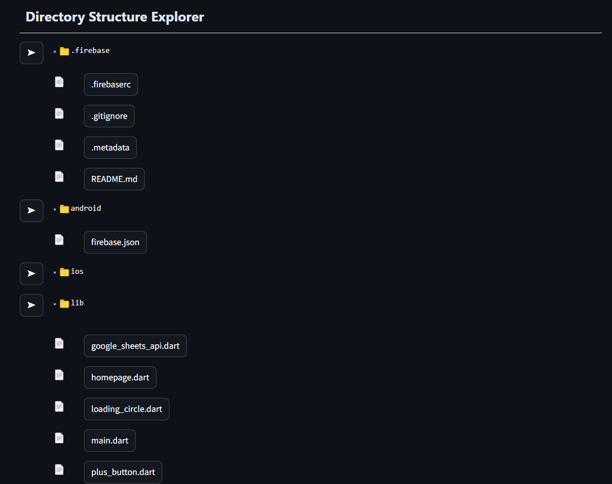

# 🚀 VIKSIT.AI

> U N D E R S T A N D I N G   T H O U S A N D S  O F  L I N E S  O F
C O D E  J U S T  G O T  E A S I E R

---

## 📌 Problem Statement


**Problem Statement 1 - Weave AI magic with Groq**

---

## 🎯 Objective

Developers spend up to 60% of their time reading and understanding complex, undocumented codebases, leading to slow onboarding, reduced productivity, and frustration, especially for new hires. Viksit.AI addresses this by automatically generating clear documentation, answering code-related queries, and making technical knowledge easily accessible by helping users visualize the project as well as providing a real time compilation support — empowering all developers, including those from socially backward communities, to contribute efficiently and confidently.

This project empowers developers, students, and individuals worldwide by providing equitable access to AI, breaking barriers of privilege and opportunity.

---

## 🧠 Team & Approach

### Team Name:  
`Tech Ghock`

### Team Members:  
- Surya Pratap Singh 
    https://github.com/Innowayshinesps
    https://www.linkedin.com/in/surya-pratap-singh-aa31a82a0/
    Full Stack Developer

- Sudharsan
    https://github.com/Sudharsan278   
    https://www.linkedin.com/in/sudharsan-venkataraman-846bb5263/
    Full Stack Developer

- Gauttham 
    https://github.com/Gauttham4
    https://www.linkedin.com/in/gauttham-r-816ab32b4/
    UI/UX Designer

- Shriram 
    https://github.com/Shreeram2722
    https://www.linkedin.com/in/shriram-swaminathan-6a4b51256/
    UI/UX Designer

### Your Approach:  
- Why you chose this problem  
    
    When I first joined as an intern, I was tasked with working on a project where the codebase consisted of thousands of lines of cluttered, undocumented code. This made it incredibly challenging to understand the project, and I found myself repeatedly asking senior developers for clarification. The constant back-and-forth was time-consuming and hindered my productivity. This experience sparked the idea for Viksit.AI — an AI-powered developer guru

- Key challenges you addressed  

    API Integration: Implemented real-time code compilation through external APIs.
    Deployment Issues: Resolved dependency conflicts during project deployment.
    Streamlit Styling: Handled challenges in visualizing and styling the project with Streamlit.
            
- Any pivots, brainstorms, or breakthroughs during hacking  

    During the time of hacking we decided to implement the community part during one of our brainstroming sessions and that's where we got the idea of making a multilingual community which was a major breakthrough

## 🛠️ Tech Stack

### Core Technologies Used:
- Frontend: Streamlit 
- Backend: Django 
- Database: Firebase 
- APIs: Groq, JDoodle, Sarvam, Google Custom Search, OAuth(for secure authentication and authorization) 
- Hosting: 
    Backend - Render
    Frontend - Streamlit Cloud Community

### Sponsor Technologies Used (if any):
- [✅] **Groq:** _We used Groq for Code and Repo analysis as well as Groq's vision for image analysis. And the combination of Groq and Google Custom Search to provide industry demanding resources_  

---

## ✨ Key Features

- ✅ Repo and Code analysis powered by Groq's multimodal capabilities
- ✅ Real time code compilation and visualization  
- ✅ Up-to-date, industry-demanding resources
- ✅ Multilingual community for global collaboration




---

## 📽️ Demo & Deliverables

- **Demo Video Link:** [https://vimeo.com/1079104676/686e1fce87?ts=0&share=copy]  
- **Pitch Deck / PPT Link:** [https://drive.google.com/file/d/1oUCz7LSHHbLojlolb95XsIS3BpCIGFU2/view?usp=sharing]  

---

## ✅ Tasks & Bonus Checklist

- [✅] **All members of the team completed the mandatory task - Followed at least 2 of our social channels and filled the form** (Details in Participant Manual)
- [✅] **All members of the team completed Bonus Task 2 - Signing up for Sprint.dev and filled the form (3 points)**
---

## 🧪 How to Run the Project

### Requirements:
- Python (Django & Streamlit)
- API's 
    => Groq
    => Sarvam
    => JDoodle
    => Google Custom Search API 

- .env file setup 
    
    => GROQ_API_KEY=""
    => GOOGLE_API_KEY=""
    => GOOGLE_CSE_ID=""
    => SARVAM_API_KEY=""
    => DJANGO_SECRET_KEY=""
    => GITHUB_TOKEN=""

### Local Setup:
```bash
# Clone the repo
git clone https://github.com/Sudharsan278/Viksit

# Install dependencies

mkdir github_browser
cd github_browser
mkdir backend frontend

pip install django djangorestframework django-cors-headers requests streamlit

cd backend
django-admin startproject backend .
python manage.py startapp github_app
mkdir -p github_app\management\commands


# Start development server

backend - python manage.py runserver [port]
frontend - streamlit run app.py

## 🧬 Future Scope

List improvements, extensions, or follow-up features:

- 📈 More integrations  
        Providing end to end multilingual support
        Providing API support
- 🛡️ Security enhancements  
        Encryption and Decryption of chat messages in the community 
- 🌐 Localization / broader accessibility  
        Complete implementation of Socially backward & Pro tier subscription models       
---

## 📎 Resources / Credits

- Groq, Sarvam, JDoodle, Google Custom Search & Oauth
- Langchain groq  

---

## 🏁 Final Words

The development phase began with immense excitement smiles on our faces and determination in our hearts. As the project progressed into the deployment phase and the deadline approached, challenges mounted and nerves kicked in. However, with constant support, unity of thought, and strong teamwork, we overcame every hurdle that came our way.
When all the pieces finally came together, the surge of pure enthusiasm and a peak dopamine rush was unmatched. Successfully meeting all our targets within the deadline was not just an achievement, but a celebration of resilience, collaboration, and relentless passion.

---